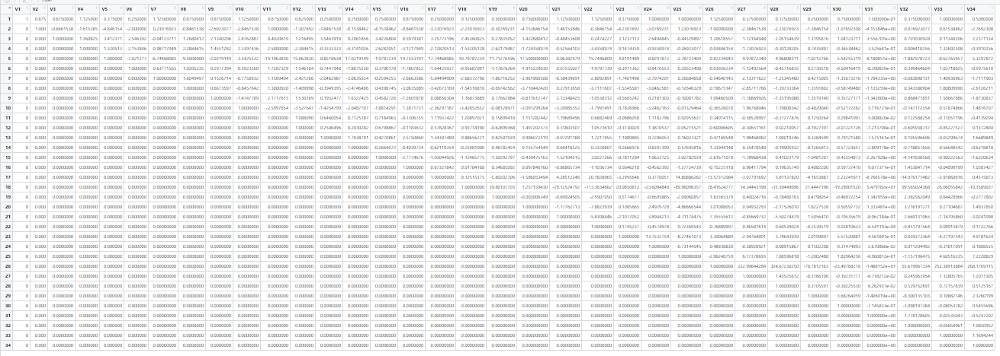
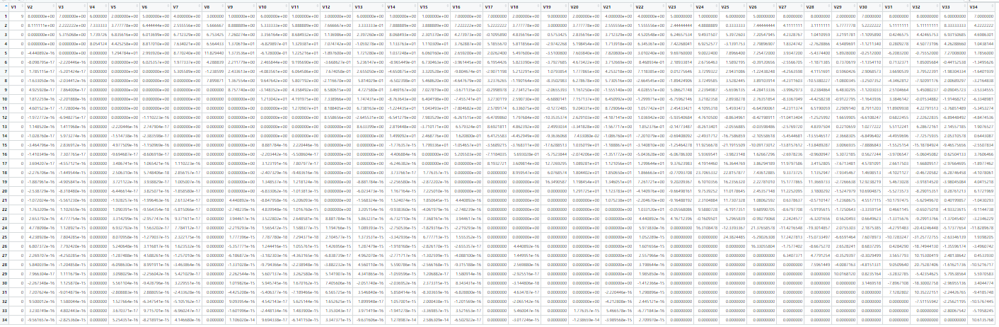
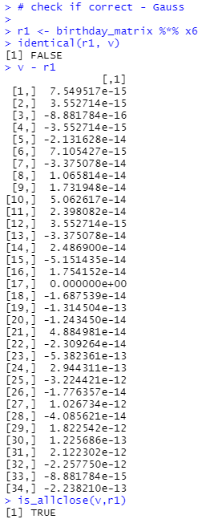
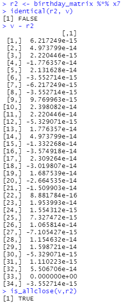

# RMiSW


Rozmiar macierzy: 20 + 5 = 25

```{r}
n <- 3
A <- matrix(runif(n^2), nrow = n)

```

Algorytm faktoryzacji LU:

```{r}
LU_factorization <- function(A) {
  n <- nrow(A)
  L <- matrix(0, nrow = n, ncol = n)
  U <- matrix(0, nrow = n, ncol = n)
  print(A)
  
  for (i in 1:n) {
    for (j in i:n) {
      U[i, j] <- A[i,j] - L[i,1:(i-1)] %*% U[1:(i-1),j]
    }
    for (j in i:n) {
      L[j,i] <- (A[j,i] - L[j,1:(i-1)] %*% U[1:(i-1),i]) / U[i,i]
    }
    L[i, i] <- 1
  }
  
  return(list(L = L, U = U))
}
```


```{r}
LU_decomposition <- LU_factorization(A)
L <- LU_decomposition$L
U <- LU_decomposition$U
```
```{r}
LU_factorization(A)
```
```{r}
L %*% U
```

```{r}
# Sprawdzenie poprawności LU faktoryzacji
is_allclose <- function(a, b, tol = 1e-10) {
  max_diff <- max(abs(a - b))
  return(max_diff < tol)
}

# Sprawdzenie, czy A = LU
if (is_allclose(A, L %*% U)) {
  print("LU faktoryzacja jest poprawna.")
} else {
  print("LU faktoryzacja jest niepoprawna.")
}
```


Algorytm faktoryzacji LU z pivotingiem:

```{r}
LU_factorization_pivot <- function(A, epsilon = 1e-10) {
  n <- nrow(A)
  md <- 1
  W <- 1:n
  L <- diag(1, nrow = n)
  U <- matrix(0, nrow = n, ncol = n)
  
  for (k in 1:(n-1)) {
    maxw <- k
    maxe <- abs(A[W[k], k])
    
    for (i in (k+1):n) {
      if (abs(A[W[i], k]) > maxe) {
        maxw <- i
        maxe <- abs(A[W[i], k])
      }
    }
    
    if (maxe <= epsilon) {
      return(NULL)  # Macierz jest zdegenerowana
    }
    
    if (maxw != W[k]) {
      md <- -md
      temp <- W[k]
      W[k] <- W[maxw]
      W[maxw] <- temp
    }
    
    U[k, ] <- A[W[k], ]
    
    for (i in (k+1):n) {
      L[i, k] <- A[W[i], k] / A[W[k], k]
      U[i, ] <- A[W[i], ] - L[i, k] * U[k, ]
    }
  }
  
  U[n, ] <- A[W[n], ]
  
  return(list(L = L, U = U))
}


```

```{r}
LU_decomposition_with_pivoting <- LU_factorization_pivot(A)
L <- LU_decomposition_with_pivoting$L
U <- LU_decomposition_with_pivoting$U
```

```{r}
LU_factorization_pivot(A)
```


```{r}
# Sprawdzenie poprawności LU faktoryzacji
is_allclose <- function(a, b, tol = 1e-10) {
  max_diff <- max(abs(a - b))
  return(max_diff < tol)
}

# Sprawdzenie, czy A = LU
if (is_allclose(A, L %*% U)) {
  print("LU faktoryzacja jest poprawna.")
} else {
  print("LU faktoryzacja jest niepoprawna.")
}
```

```{r}

LU_decomposition <- LU_factorization_with_pivoting(A)
L <- LU_decomposition$L
U <- LU_decomposition$U
P <- LU_decomposition$P

# Sprawdzenie, czy A = PLU
if (is_allclose(A, P %*% L %*% U)) {
  print("LU faktoryzacja z pivotingiem jest poprawna.")
} else {
  print("LU faktoryzacja z pivotingiem jest niepoprawna.")
}
```

```{r}
L %*% U
```

```{r}
A
```

# Eliminacja Gaussa


Macierz rozmiaru dzień urodzenia + miesiąc urodzenia

```{r}
date <- 28 + 6
birthday_matrix <- matrix(sample(1:9, date*date, replace=TRUE), nrow=date)
```

Wektor wyrazów wolnych do układu równań
```{r}
v <- t(matrix(runif(date, min=-10, max=20), nrow=1))
```

### Pseudokod algorytmu eliminacji Gaussa generującego jedynki

1. Dla każdego wiersza 'row' od 1 do (n - 1):
- a. coef_div = m_copy[row, row]
- b. Dla każdego wiersza 'j' od (row + 1) do n:
    - i. coef_sub = m_copy[j, row]
    - ii. m_copy[j, ] = m_copy[j, ] - m_copy[row, ] * coef_sub

2. Jeśli ostatni wiersz nie jest znormalizowany (m_copy[n, n] != 1):
  - a. m_copy[n, ] = m_copy[n, ] / m_copy[n, n] 

3. Zwróć macierz (bez ostatniej kolumny) i ostatnią kolumnę (wektor b) z m_copy.


### Algorytm eliminacji Gaussa generujący jedynki na przekątnej

```{r}
gauss <- function(m, b) {
  m_copy <- m
  n <- nrow(m)
  
  m_copy <- cbind(m_copy, b)
  
  for (row in 1:(n - 1)) {
    coef_div <- m_copy[row, row]
    m_copy[row, ] <- m_copy[row, ] / coef_div
    
    for (j in (row + 1):n) {
      coef_sub <- m_copy[j, row]
      m_copy[j, ] <- m_copy[j, ] - m_copy[row, ] * coef_sub
    }
  }
  
  # Normalizacja ostatniego wiersza, jeśli to konieczne
  if (m_copy[n, n] != 1) {
    m_copy[n, ] <- m_copy[n, ] / m_copy[n, n]
  }
  
  # Zwrócenie macierzy i wektora b
  return(list(matrix = m_copy[, -ncol(m_copy)], vector = m_copy[, ncol(m_copy)]))
}
```


### Pseudokod algorytmu eliminacji Gaussa z pivotingiem

1. Dla każdej kolumny 'i' od 1 do (n - 1):
- a. Znajdź pivot jako maksymalną wartość w kolumnie 'i' dla wierszy od (i + 1) do n.
- b. Znajdź indeks wiersza z maksymalnym pivotem: max_row_index = indeks wiersza z maksymalnym pivotem + i.

    - Jeśli pivot > m_copy[i, i]:
          Zamień miejscami wiersze 'i' i 'max_row_index' w macierzy 'm_copy'.

    - Dla każdego wiersza 'j' od (i + 1) do n:
      - i. Oblicz współczynnik coef = m_copy[j, i] / m_copy[i, i].
      - ii. Odjęcie wiersza 'i' pomnożonego przez coef od wiersza 'j'.

2. Zwróć macierz (bez ostatniej kolumny) i ostatnią kolumnę (wektor b) z m_copy.


### Algorytm eliminacji Gaussa z pivotingiem

```{r}
gauss_with_pivot <- function(m, b) {
  m_copy <- m
  n <- nrow(m)
  
  m_copy <- cbind(m_copy, b)
  
  for (i in 1:(n - 1)) {
    pivot <- max(m_copy[(i + 1):n, i])
    max_row_index <- which.max(m_copy[(i + 1):n, i] == pivot) + i
    
    if (pivot > m_copy[i, i]) {
      temp_row <- m_copy[i, ]
      m_copy[i, ] <- m_copy[max_row_index, ]
      m_copy[max_row_index, ] <- temp_row
    }
    
    for (j in (i + 1):n) {
      coef <- m_copy[j, i] / m_copy[i, i]
      m_copy[j, ] <- m_copy[j, ] - m_copy[i, ] * coef
    }
  }
  
  # Return the matrix and b vector separately
  return(list(matrix = m_copy[, -ncol(m_copy)], vector = m_copy[, ncol(m_copy)]))
}
```




### Pseudokod funkcji solve()

1. Wykonaj eliminację Gaussa na macierzy 'm' i wektorze 'b' za pomocą funkcji 'func', która zwraca macierz współczynników i wektor 'b' po eliminacji.
2. Przypisz macierz współczynników do 'coef_matrix' i wektor 'b' do 'b_vector'.
3. Określ liczbę równań 'n' na podstawie liczby wierszy macierzy 'coef_matrix'.
4. Zainicjuj wektor wynikowy 'x' jako pusty wektor numeryczny o długości 'n'.

5. Wsteczne podstawianie:
  - a. Dla każdego i od n do 1, malejąco:
    - i. Oblicz x[i] jako iloraz b_vector[i] i coef_matrix[i, i].
    - ii. Jeśli i < n, oblicz x[i] jako różnicę b_vector[i] i sumy iloczynów elementów coef_matrix[i, (i + 1):n] i x[(i + 1):n], podzieloną przez coef_matrix[i, i].

6. Zwróć wektor wynikowy 'x'.


### Funkcja solve() rozwiązująca układ równań
```{r}
solve <- function(m, b, func) {
  # Gauss elimination
  result <- func(m, b)
  coef_matrix <- result$matrix
  b_vector <- result$vector
  print(coef_matrix)
  
  n <- nrow(coef_matrix)
  x <- numeric(n)

  # Wsteczne podstawianie
  for (i in seq(n, 1, -1)) {
    
    x[i] <- b_vector[i]/coef_matrix[i, i]
    if (i < n) {
      x[i] <- (b_vector[i] - sum(coef_matrix[i, (i + 1):n] * x[(i + 1):n])) / coef_matrix[i, i]
    }
  }
  
  return(x)
}
```

Obliczenie wyników korzystając z obu algorytmów eliminacji Gaussa

```
# calculate results for Gauss and Gauss with Pivot
x6 <- solve(birthday_matrix, v, gauss)
x7 <- solve(birthday_matrix, v, gauss_with_pivot)
```

Sprawdzenie czy rozwiązania są identyczne dla obu metod eliminacji

```{r}
identical(x6, x7)
```

W celu sprawdzenia poprawności (czy oryginalna macierz przemnożona przez wektor X rozwiązań jest równa wektorowi b) ponownie wykorzystujemy funkcję *is_allclose()*, która dopuszcza ustalony błąd 

```{r}
# check if correct - Gauss
r1 <- birthday_matrix %*% x6
is_allclose(v,r1)
```

```{r}
# check if correct - Gauss with pivot
r2 <- birthday_matrix %*% x7
is_allclose(v,r2)
```




