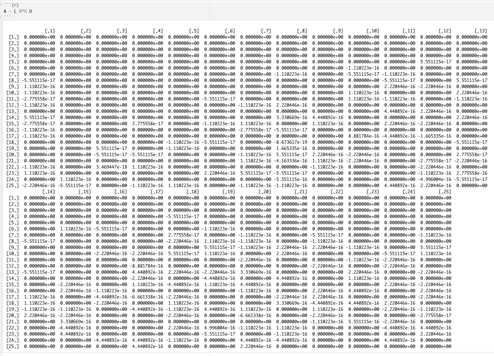

# 


# 


# 


# <center> Eliminacja Gaussa i Faktoryzacja LU </center>

---


<center> Rachunek Macierzowy i Statystyka Wielowymiarowa </center>

---
# 


# 


# 


# 


# 


# 


# 

# 


# 
# 

**Ewa Pelc**  
**Ewa Żukowska** 

***
# 
## Faktoryzacja LU


Rozmiar macierzy: 20 + 5 = 25

```{r}
n <- 25
A <- matrix(runif(n^2), nrow = n)

```
### Pseudokod algorytmu LU

1. Zainicjuj 𝐋 jako macierz identycznościową, 𝐈 o wymiarach 𝑛×𝑛 oraz 𝐔 = 𝐀.
2. Dla 𝑖 = 1 ,…, 𝑛 wykonaj krok 3.
3. Dla 𝑗 = 𝑖 + 1, …, 𝑛 wykonaj kroki 4-5.
4. Ustaw 𝑙𝑗𝑖=𝑢𝑗𝑖/𝑢𝑖𝑖.
5. Wykonaj 𝑈𝑗=(𝑈𝑗 − 𝑙𝑗𝑖 * 𝑈𝑖) (gdzie 𝑈𝑖, 𝑈𝑗 reprezentują odpowiednio wiersze 𝑖 oraz 𝑗 macierzy 𝐔).


### Algorytm faktoryzacji LU:

```{r}
LU_factorization <- function(A) {
  n <- nrow(A)
  L <- matrix(0, nrow = n, ncol = n)
  U <- matrix(0, nrow = n, ncol = n)
  print(A)
  
  for (i in 1:n) {
    for (j in i:n) {
      U[i, j] <- A[i,j] - L[i,1:(i-1)] %*% U[1:(i-1),j]
    }
    for (j in i:n) {
      L[j,i] <- (A[j,i] - L[j,1:(i-1)] %*% U[1:(i-1),i]) / U[i,i]
    }
    L[i, i] <- 1
  }
  
  return(list(L = L, U = U))
}
```
#### Sprawdzenie poprawności LU faktoryzacji

W celu sprawdzenia poprawności faktoryzacji zdefiniowałyśmy funkcję, która porównuje dwa obiekty dopuszczając ustalony błąd. 

```{r}
is_allclose <- function(a, b, tol = 1e-10) {
  max_diff <- max(abs(a - b))
  return(max_diff < tol)
}
```
#### Sprawdzenie, czy A = LU

```{r}
if (is_allclose(A, L %*% U)) {
  print("LU faktoryzacja jest poprawna.")
} else {
  print("LU faktoryzacja jest niepoprawna.")
}
```
### Pseudokod algorytmu LU z pivotingiem

1. Zainicjuj macierze 𝐋 = 𝐏 = 𝐈 o wymiarach 𝑛×𝑛 oraz 𝐔 = 𝐀.
2. Dla każdego 𝑖 = 1, …, 𝑛 wykonaj kroki 3 - 4, 8.
3. Niech 𝑘 = 𝑖. 
4. Dopóki 𝑢𝑖𝑖 = 0, wykonuj kroki 5-7.
5. Zamień miejscami wiersz 𝑈𝑖 z wierszem 𝑈𝑘+1.
6. Zamień miejscami wiersz 𝑃𝑖 z wierszem 𝑃𝑘+1.
7. Zwiększ wartość 𝑘 o 1.
8. Dla każdego 𝑗 = 𝑖+1, …, 𝑛 wykonaj kroki 9 - 10.
9. Ustaw wartość 𝑙𝑗𝑖 = 𝑢𝑗𝑖/𝑢𝑖𝑖.
Wykonaj operację 𝑈𝑗 = 𝑈𝑗 − 𝑙𝑗𝑖 * 𝑈𝑖 (gdzie 𝑈𝑖,𝑈𝑗 reprezentują odpowiednio 𝑖-ty i 𝑗-ty wiersz macierzy 𝐔).

### Algorytm faktoryzacji LU z pivotingiem:

```{r}

LU_factorization_with_pivoting <- function(A) {
  n <- nrow(A)
  L <- diag(n)  # Macierz L inicjujemy jako macierz jednostkową
  P <- diag(n)  # Macierz permutacji P inicjujemy jako macierz jednostkową
  U <- A        # Macierz U inicjujemy jako macierz A
  
  for (i in (1:(n-1)) ){
    k <- i
    
    # Szukanie elementu maksymalnego w kolumnie i
    while (U[i, i] == 0) {
      if (k > n) {
        return("Macierz jest zdegenerowana.")
      }
      U[c(k, k+1), ] <- U[c(k+1, k), ]
      P[c(k, k+1), ] <- P[c(k+1, k), ]
      k <- k + 1
    }
    
    # Eliminate entries below i with row operations on U 
    # and reverse the row operations to manipulate L
    factor <- U[(i+1):n, i] / U[i, i]
    L[(i+1):n, i] <- factor
    U[(i+1):n, ] <- U[(i+1):n, ] - outer(factor, U[i, ])
  }
  
  return(list(P = P, L = L, U = U))
}

```

```{r}
LU_decomposition_with_pivoting <- LU_factorization_with_pivoting(A)
L <- LU_decomposition_with_pivoting$L
U <- LU_decomposition_with_pivoting$U
```

#### Sprawdzenie, czy A = PLU:

```{r}
if (is_allclose(A, P %*% L %*% U)) {
  print("LU faktoryzacja z pivotingiem jest poprawna.")
} else {
  print("LU faktoryzacja z pivotingiem jest niepoprawna.")
}

```

Poniższa macierz przedstawia różnicę, między macierzą A, a zaproponowanym przez nas rozkładem LU. Jak widać, na niektórych pozycjach wartości są różne, jednak różnica ta jest rzędu 10^16.



