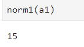
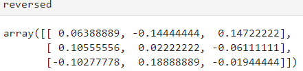
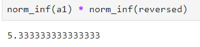
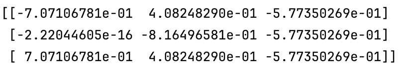
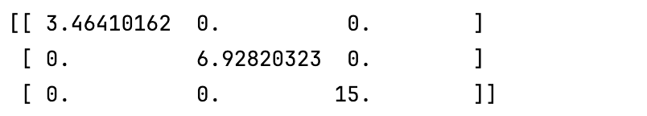
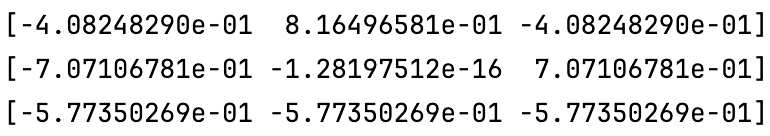
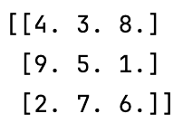

# 


# 


# 


# <center> Normy macierzowe i rozkład według wartości osobliwych (SVD) </center>

---


<center> Rachunek Macierzowy i Statystyka Wielowymiarowa </center>

---
# 


# 


# 


# 


# 


# 

# 


# 

# 


# 
# 

**Ewa Pelc**  
**Ewa Żukowska** 

***

## Dane

Do testów poprawności funkcji wykorzystano macierz tybetańską rozmiaru 3x3 z wykładu.

```{python}
a1 = np.array([[4, 9, 2], [3, 5, 7], [8, 1, 6]])
```


## Norma indukowana jedynkowa

Norma indukowana jedynkowa jest obliczona jako maksymalna suma wartości bezwzględnych z kolumn. Jest to alternatywny sposób obliczania normy jednostkowej zaprezentowany na wykładzie.

W celu ułatwienia sumowania w bibliotece numpy, najpierw wykonano transpozycję macierzy - aby móc sumować w kolumnach.

```{python}
def norm1(m):
    a = m.T
    return np.max([sum(abs(row))for row in a])
```

**Wynik dla macierzy a1:**




**Współczynnik uwarunkowania dla normy jedynkowej i macierzy a1:**

Do obliczenia macierzy odwrotnej posłużono się funkcją biblioteki numpy

```{python}
reversed = np.linalg.inv(a1)
```



**Interpretacja współczynnika uwarunkowania**

Współczynnik uwarunkowania macierzy mówi nam, jak bardzo dane rozwiązanie jest wrażliwe na niewielkie zmiany wejściowe, takie jak zaburzenia w danych lub błędy numeryczne.

Im większy współczynnik uwarunkowania, tym bardziej macierz jest źle uwarunkowana, co oznacza, że ​​jest bardziej wrażliwa na zmiany

## Norma indukowana nieskończoność

Norma indukowana nieskończoność jest obliczona jako maksymalna suma wartości bezwzględnych z wierszy. Jest to alternatywny sposób obliczania normy nieskończoność zaprezentowany na wykładzie.

```python
def norm_inf(m):
    return np.max([sum(abs(row)) for row in m])
```

Wynik dla macierzy a1:


Współczynnik uwarunkowania:



## Norma indukowana dwójkowa (norma spektralna)

Norma indukowana dwójkowa jest obliczana  największa (na moduł) wartość własna macierzy A. Jest to alternatywny sposób obliczania zaprezentowany na wykładzie.

Zgodnie z wytycznymi, do wyznaczenia wektorów i wartości własnych macierzy posłużono się biblioteką numerycznej z wybranego języka programowania.


```python
def norm2(m):
    return np.max(abs(np.linalg.eig(m).eigenvalues))
```

Wynik dla macierzy a1:


Współczynnik uwarunkowania:


## p-norma macierzowa

P-norma macierzowa jest obliczana jako p-norma wektorowa zastosowana do każdego wiersza macierzy, a następnie obliczenie sumy wyników. W rezultacie otrzymujemy sumę wszystkich elementów podniesionych do potęgi p, a następnie obliczamy pierwiastek p-tego stopnia z tej sumy.

Wykonano obliczenia dla p=4

```python
def normp(m, p):
    inner = np.sum(np.power(m, p))
    outer = np.power(inner, (1/p))
    return outer
```

Wynik dla macierzy a1:


Współczynnik uwarunkowania:


# 

# 
## Rozkład według wartości własnych - Singular Value Decomposition (SVD)


### Pseudokod
> Input: Macierz A o wymiarach m x n \
> Output: Macierze U, ∑, V^T
>
> 1. Oblicz macierz kowariancji C = A^T * A
>
> 2. Znajdź dominujące wektory własne macierzy kowariancji C za pomocą metody potęgowej: \
   > Dla każdego i od 1 do k:\
     a) Losowo wygeneruj wektor startowy v\
     b) Dla zadanego kroku iteracyjnego j od 1 do max_iter:
          v = C * v
          v = v / ||v|| \
     c) Dodaj uzyskany wektor własny do listy dominujących wektorów własnych
> 3. Przekształć uzyskane dominujące wektory własne na macierze ortogonalne U i V:
   U = [v_1, v_2, ..., v_k]
   V = [u_1, u_2, ..., u_k]
> 4. Oblicz wartości własne macierzy kowariancji C i przekształć je w macierz diagonalną ∑:
   Dla każdej wartości własnej λ_i:
     ∑_i = sqrt(λ_i)
   ∑ = diag( [∑_1, ∑_2, ..., ∑_k] )
> 5. Zwróć macierze U, ∑, V transponowane
> 

### Kod


```python
def svd(A):
    # Obliczenie macierzy kowariancji
    C = np.dot(A.T, A)
    
    # Znalezienie dominujących wektorów własnych 
    # macierzy kowariancji
    eigenvalues, eigenvectors = np.linalg.eigh(C)
    
    # Przekształcenie dominujących wektorów własnych
    # na macierze ortogonalne U i V
    U = eigenvectors
    V = np.dot(A, U) / np.linalg.norm(np.dot(A, U), axis=0)
    
    # Obliczenie macierzy Sigma
    s = np.sqrt(np.abs(eigenvalues))
    Sigma = np.diag(s)
    
    return U, Sigma, V.T
```

### Wyniki dla macierzy 

```python
A = np.array([[4, 9, 2], [3, 5, 7], [8, 1, 6]])

U, Sigma, Vt = svd(A)
```

Macierz U:




Macierz Sigma:




Macierz V transponowane:





Macierz U*Σ*V^T = A:





